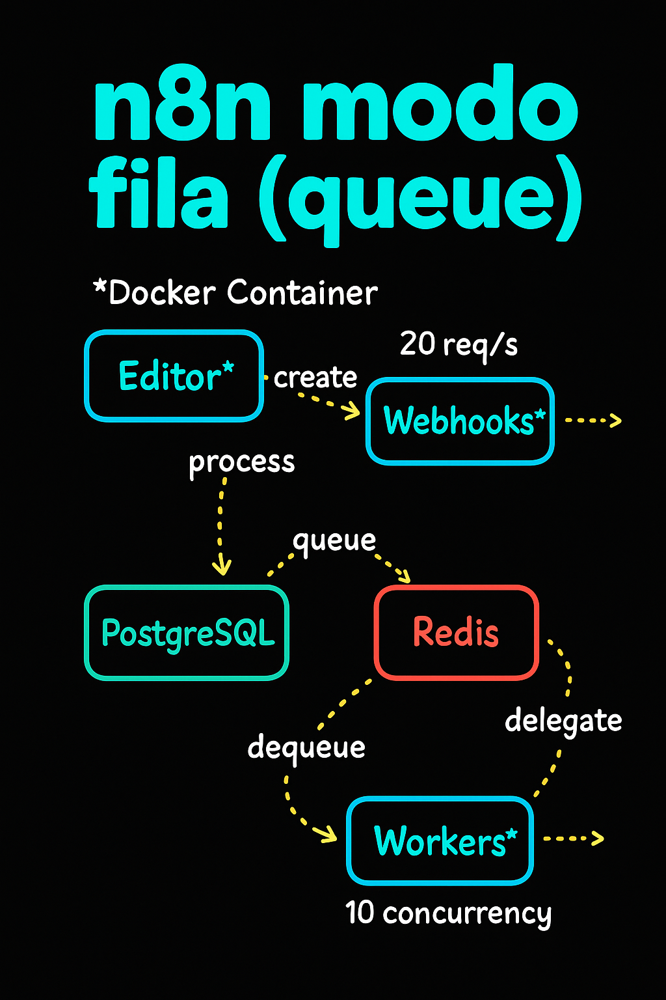

# n8n Queue Docker Compose Stack



## Overview
This project provides a ready-to-use structure for running n8n in a scalable mode using Docker Compose, with separate services for the editor, workers, webhooks, Postgres database, and Redis. It's ideal for production environments, testing, or learning about n8n's distributed architecture.

## Services
- **n8n-editor**: n8n web interface (port 5678), manages workflows and orchestrates executions.
- **n8n-workers**: Executes workflows in queue mode (port 5676), enabling horizontal scalability.
- **n8n-webhooks**: Handles webhook endpoints (port 5677), useful for high availability and separation of responsibilities.
- **postgres**: Persistent Postgres database for storing n8n data.
- **redis**: Queue backend for distributed workflow execution.

## Usage
1. **Initial setup**:
   - Create a `.env` file with the required variables (see example below).
   - n8n, Postgres, and Redis data are persisted in local volumes (`./n8n_data`, `./postgres_data`, `./redis_data`).
2. **Start the services**:
   ```sh
   docker compose up --build -d
   ```
   Or use the provided Makefile for convenience:
   ```sh
   make deploy
   ```
   (This will stop, remove, and start all services with fresh volumes.)
3. **Access the editor**:
   - Web interface: http://localhost:5678
   - Worker: http://localhost:5676
   - Webhook: http://localhost:5677
4. **Stop the services**:
   ```sh
   docker compose down
   ```
   (Data persists in the volumes)

## File Structure
- `docker-compose.yaml`: Orchestrates all services and volumes.
- `.env`: Environment variables for credentials and configuration.
- `Makefile`: Helper for deploying the stack with a single command.
- `n8n_data/`, `postgres_data/`, `redis_data/`: Persistent volumes.

## Example .env
```env
N8N_HOST=localhost
N8N_BASIC_AUTH_USER=admin
N8N_BASIC_AUTH_PASSWORD=adminpassword
POSTGRES_DB=n8n
POSTGRES_USER=postgres
POSTGRES_PASSWORD=postgrespassword123
N8N_EDITOR_BASE_URL=http://localhost:5678
```

## Recommendations
- For production, change all passwords and set secure environment variables.
- To scale workers, increase the number of replicas for the `n8n-workers` service.
- See the [official n8n documentation](https://docs.n8n.io/hosting/scaling/) for details on execution modes and distributed architecture.

## Credits
Based on the architecture recommended by n8n for scalable and distributed environments.

---
Contribute suggestions, improvements, or questions via issues or pull requests!
